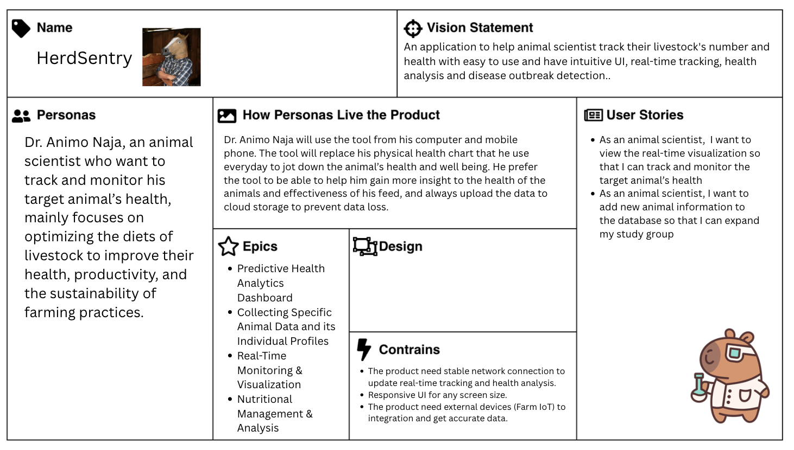

# HerdSentry 🐄📊

**Next-Generation Animal Health Monitoring and Research Platform**

## 🎯 Product Overview

**For:** Animal Scientists and Livestock Researchers  
**Who want to:** Improve animal health and enhance research capabilities  
**HerdSentry is:** An application to help animal scientists track their livestock's number and health with easy-to-use and intuitive UI, real-time tracking, health analysis, and disease outbreak detection.  
**Unlike:** Traditional animal health checks and waiting for delayed government reports  
**Our product:** Is designed to streamline monitoring and help scientists improve animal health and enhance insight to research information.

---

## 👨‍🔬 Meet Our Primary User: Dr. Animo Naja

**Profile:**
- **Age:** 26 years old
- **Location:** Kwara State, Nigeria
- **Specialization:** Nutritional Biology
- **Passion:** Optimizing livestock diets to enhance animal health, boost productivity, and support sustainable farming practices

**Goals:**
- Improve animal health and welfare
- Create a positive and productive work environment
- Manage time and tasks effectively
- Focus on innovative research and sustainable practices

**Pain Points:**
- Research is a slow process, often taking years to produce definitive results
- Frequent research setbacks and delays
- Manual data collection and analysis is time-consuming
- Limited real-time insights for decision-making

**Value Proposition:**
HerdSentry provides Dr. Animo with a reliable platform that streamlines monitoring and research, offering an easy-to-use, intuitive application for real-time tracking and health analysis. This helps him make data-driven decisions more efficiently, allowing focus on innovative research rather than getting bogged down by manual processes.

---

## 📋 Product Backlog

| Story ID | User Story | Acceptance Criteria | Priority | Story Points | Status |
|----------|------------|-------------------|----------|--------------|---------|
| **S01** | "As an animal Scientist, I want to register new animals and create individual profiles in the system so that I can start comprehensive health tracking from the beginning." | "Given that the animal scientist provides complete basic information (ID, species, breed, age, weight)<br>When creating a new animal profile<br>Then the system will successfully save the profile and generate a unique tracking ID." | 1 | 8 | ✅ **COMPLETED** |
| **S02** | "As an animal Scientist, I want to insert the animal data and update it in the system so that I can manually update the misinformed data" | "Given that the animal scientist login to the application and there is existing data in the system<br>When the animal scientist opens the edit dashboard page<br>Then the system should display available options and configurations for customizing the content, layout, and representation of the information." | 2 | 3 | ✅ **COMPLETED** |
| **S03** | "As an animal Scientist, I want to record medical examinations and import diagnostic test results into individual animal profiles so that I can maintain comprehensive health records in one location." | "**Acceptance Criteria 1**<br>Given that the animal scientist enters the medical examination or diagnostic test results<br>When saving the medical records<br>Then the system will timestamp the record time and create the unique record ID and save it to the records.<br><br>**Acceptance Criteria 2**<br>Given that the animal scientist enters record ID<br>When retrieving the medical records<br>Then the system will query the record databases and return the data that record ID matches to user input." | 3 | 13 | ✅ **COMPLETED** |
| **S04** | "As an animal scientist, I want to view the animal's feed and its nutritional value, so that I can easily analyze how the feed impacts the animal's health" | "Given that the animal scientist have existing data on animals feed and its nutritional value<br>When the animal scientist opens the nutritional management page<br>Then the system should display all relevant feed information, its nutritional value and the associated animal health data." | 4 | 0.5 | ✅ **COMPLETED** |
| **S05** | "As an animal Scientist, I want to view all my animals on a live geospatial map, so that I can correlate location and movement patterns with their health issues." | "Given that the animal is tagged with the GPS<br>When the animal scientist open the live geospatial map<br>Then the system show the location and movement of the animals on the map" | 5 | 5 | 🚧 **IN PROGRESS** |
| **S06** | "As an animal scientist, I want to see a comparison of the health scores for animals on different diets, so that I can easily tell which feed is more effective." | "Given that the animal scientist feed the same type of animal with different diets<br>When the animal scientist navigates to the Nutritional Analysis screen<br>Then the system must display a comparison view of the health scores for animals." | 6 | 2 | ✅ **COMPLETED** |
| **S07** | "As an animal scientist, I want to see cost of animal food in one day, so that I can calculate the cost of animal eat in one day." | "Given that the animal scientist have data on animal food cost<br>When animal scientist open the calculate food cost page<br>Then the system calculate the food cost of animal in one day" | 7 | 1 | ✅ **COMPLETED** |
| **S08** | "As an animal Scientist, I want to replay animal's movement history, so that I can analyze their overall condition" | "Given that the system store past movement history of the animal<br>When the animal scientist selected the date and time to check<br>Then the system should show the past movement path of the animal" | 8 | 20 | 📋 **PLANNED** |
| **S09** | "As an animal Scientist, I want to view the predictive health analytics dashboard, so that I can check the overall health and well being of the animals." | "Given that the animal scientist login to the application and there is existing data in the system<br>When the animal scientist open the dashboard page<br>Then the system will show the predictive health prediction of the animal in their care." | 9 | 20 | 📋 **PLANNED** |
| **S10** | "As an animal Scientist, I want to be able to edit the predictive health analytics dashboard, so that I can configure what information is displayed, where it appears, and how it is represented." | "Given that the animal scientist login to the application and there is existing data in the system<br>When the animal scientist opens the edit dashboard page<br>Then the system should display available options and configurations for customizing the content, layout, and representation of the information." | 10 | 5 | 📋 **PLANNED** |
| **S11** | "As an animal Scientist, I want to be able to export the analysis result and visualisation, so that I can share the analysis result with other people." | "Given that the animal scientist login to the application and there is existing data in the system<br>When the animal scientist select the share button and choose which data to share<br>Then the system should display available file type options and export the information in the select file type." | 11 | TBD | 📋 **PLANNED** |
| **S12** | "As an animal Scientist, I want to get the notifications of the animal with abnormal behavior, so that I can check their condition in real-time" | "Given that the animal scientist enable notification in the system<br>When the animal is detected showing abnormal behavior<br>Then the system should send the notification to the animal scientist in real-time" | 12 | 20 | 📋 **PLANNED** |

**Total Story Points:** 97.5+ points

---

## 🎨 Scrum Product Canvas

Our product development follows the Scrum framework with a comprehensive Product Canvas that outlines our vision, target users, and key features:



### Canvas Overview

The Scrum Product Canvas provides a structured approach to our product development, covering:

- **📍 Target Group**: Animal Scientists and Livestock Researchers like Dr. Animo Naja
- **🎯 Big Picture Goal**: Streamline animal health monitoring and research processes
- **💡 Product Box**: Easy-to-use platform with real-time tracking and health analysis
- **🚫 NOT Goals**: Not replacing veterinary expertise, not for consumer pet tracking
- **⭐ Product Details**: Core features including medical records, file management, and analytics

This canvas serves as our north star, ensuring all development efforts align with our vision of empowering animal scientists with efficient, data-driven tools for livestock health management.

---

## 👥 Development Team Capacity

| ID | Person | Days Available | Days for Scrum Activities | Hours per Day | Min Available Hours | Max Available Hours |
|----|--------|----------------|---------------------------|---------------|-------------------|-------------------|
| 6688005 | Pim | 8 | 2 | 3-4 | 18 | 24 |
| 6688064 | Yok | 8 | 2 | 3-5 | 18 | 30 |
| 6688091 | Pun | 8 | 2 | 3-4 | 18 | 24 |
| 6688175 | Khowpun | 8 | 2 | 3-4 | 18 | 24 |
| 6688249 | Pete | 6 | 2 | 3-8 | 12 | 32 |
| **Total** | **5 Members** | **38 Days** | **10 Days** | **15-25 Hours** | **84 Hours** | **134 Hours** |

---

## 🌟 Current Features & Functions

### 🏥 Medical Records Management (S03 - Completed ✅)
- **Comprehensive Medical Examinations**: Record detailed veterinary examinations with vital signs, diagnoses, and treatment plans
- **Diagnostic Results Import**: Bulk import laboratory test results with structured JSON format
- **Medical File Upload**: Advanced file management system with categorization and metadata
- **Unique Record Tracking**: Every medical record gets a unique tracking ID (EXAM-2025-001, DIAG-2025-001, FILE-2025-001)
- **Medical History Timeline**: Complete medical history tracking per animal
- **Search by Record ID**: Quick retrieval of any medical record using unique identifiers

**Functions in Program:**
- `POST /api/animals/:id/medical/exam` - Create comprehensive medical examination
- `POST /api/animals/:id/medical/diagnostics` - Import diagnostic test results
- `GET /api/medical/search/:recordId` - Search records by unique ID
- `PUT /api/medical/exam/:examId` - Update medical examinations
- Medical audit logging with complete activity tracking

### 📁 Advanced File Management (S03 - Completed ✅)
- **Multi-format Support**: Images (JPEG, PNG, GIF), PDFs, Word documents, text files
- **Drag & Drop Upload**: Intuitive file upload with drag-and-drop interface
- **File Categorization**: X-Ray, Ultrasound, Photos, Documents, Lab Reports, Certificates
- **Access Control**: Public, Restricted, and Confidential access levels
- **Metadata Management**: Descriptions, tags, and linking to exams/diagnostics
- **Visual File Browser**: Grid and list view modes with image previews

**Functions in Program:**
- `POST /api/animals/:id/medical/files` - Upload medical files with metadata
- `GET /api/animals/:id/medical/files` - Retrieve files for specific animal
- `GET /api/medical/files/:fileId/download` - Download files with access logging
- Enhanced medical file manager interface with search and filtering

### 🐾 Animal Management (S01, S02 - Completed ✅)
- **Individual Animal Profiles**: Complete animal registration with species, breed, age, weight
- **Unique Tracking IDs**: Automatic generation of unique animal identifiers
- **Species Management**: Expandable species database with custom notes
- **Data Updates**: Full CRUD operations for animal information
- **Edit Dashboard**: Customizable interface for data management

**Functions in Program:**
- `POST /api/animals` - Register new animals with profile creation
- `GET /api/animals` - Retrieve all animals with species information
- `POST /api/species/add` - Add new species to the database
- `PUT /api/animals/:id` - Update animal information
- Real-time validation and error handling

### 🍽️ Nutritional Management (S04, S06, S07 - Completed ✅)
- **Feed Analysis**: Comprehensive feeding management and nutritional analysis
- **Diet Comparison**: Health score comparison for animals on different diets
- **Cost Calculation**: Daily feed cost computation per animal
- **Nutritional Value Display**: Detailed feed composition and impact analysis

**Functions in Program:**
- `GET /api/feeditems/details` - Retrieve detailed nutritional information
- `POST /api/diets/add` - Create new diet plans with components
- `GET /api/reports/diet-health` - Generate diet vs health comparison reports
- Daily feed cost calculation algorithms
- Nutritional impact analysis on animal health

### 🗺️ Geospatial Tracking (S05 - In Progress 🚧)
- **Live Map View**: Real-time animal location tracking
- **Movement Patterns**: Correlation between location and health issues
- **GPS Integration**: Support for GPS-tagged animals

**Functions in Program:**
- Interactive map interface with animal markers
- Location data management and storage
- Movement pattern analysis algorithms

### 📊 Reporting & Analytics (S06, S09, S10 - Partially Completed/Planned 📋)
- **Medical Activity Dashboard**: Recent medical activities across all animals
- **Health Score Analytics**: Comparative analysis of animal health metrics
- **File Statistics**: Upload trends and storage analytics
- **Health Summary Reports**: Comprehensive medical summaries per animal
- **Audit Trail**: Complete activity logging for compliance

**Functions in Program:**
- `GET /api/medical/recent` - Recent medical activity feed
- `GET /api/medical/summary` - Comprehensive medical statistics
- `GET /api/reports/diet-health` - Diet effectiveness analysis
- Dashboard customization interfaces (planned)
- Predictive health analytics (planned)

## 🛠️ Technology Stack

- **Backend**: Node.js, Express.js
- **Database**: MySQL with comprehensive relational schema
- **File Storage**: Local filesystem with organized directory structure
- **Frontend**: HTML5, Tailwind CSS, Vanilla JavaScript
- **File Upload**: Multer middleware for multi-part form handling
- **Security**: Input validation, file type restrictions, access control

## 📦 Installation

### Prerequisites
- Node.js (v14 or higher)
- MySQL (v8.0 or higher)
- npm or yarn package manager

### Setup Steps

1. **Clone the repository**
   ```bash
   git clone https://github.com/Pundharee6688091/HerdSentry.git
   cd HerdSentry
   ```

2. **Install dependencies**
   ```bash
   npm install
   ```

3. **Database Setup**
   ```bash
   # Create the main database
   mysql -u root -p < sql/animal.sql
   
   # Create medical records schema
   mysql -u root -p < sql/medical.sql
   
   # Optional: Load sample data
   mysql -u root -p < sql/seed_data.sql
   ```

4. **Environment Configuration**
   Create a `.env` file in the root directory:
   ```env
   MYSQL_HOST=localhost
   MYSQL_USERNAME=your_mysql_username
   MYSQL_PASSWORD=your_mysql_password
   MYSQL_DATABASE=animals
   PORT=3000
   ```

5. **Create Upload Directories**
   ```bash
   mkdir -p uploads/medical
   ```

6. **Start the Application**
   ```bash
   npm start
   ```

7. **Access the Application**
   Open your browser and navigate to `http://localhost:3000`

## 🗄️ Database Schema

### Core Tables
- **Animals**: Animal profiles with basic information
- **Species**: Animal species catalog
- **Diets**: Feeding plans and nutritional information
- **Feed_Items**: Feed components and nutritional values

### Medical Records Tables
- **Medical_Exams**: Comprehensive veterinary examinations
- **Diagnostic_Results**: Laboratory and diagnostic test results
- **Medical_Files**: File storage with metadata and linking
- **Medical_Audit_Log**: Activity tracking and compliance logging
- **Medical_Record_Sequences**: Unique ID generation management

### Key Features
- **Automatic Unique ID Generation**: Each record gets a timestamped unique identifier
- **Comprehensive Indexing**: Optimized for fast searches and retrieval
- **Relational Integrity**: Foreign key constraints ensure data consistency
- **Audit Trail**: Complete activity logging for all medical records

## 🔌 API Endpoints

### Medical Examinations
```http
GET    /api/animals/:id/medical              # Get all medical records for animal
POST   /api/animals/:id/medical/exam         # Create new medical examination
PUT    /api/medical/exam/:examId             # Update medical examination
GET    /api/medical/search/:recordId         # Search by unique record ID
```

### Diagnostic Results
```http
POST   /api/animals/:id/medical/diagnostics  # Import diagnostic results
PUT    /api/medical/diagnostic/:resultId     # Update diagnostic result
```

### File Management
```http
POST   /api/animals/:id/medical/files        # Upload medical files
GET    /api/animals/:id/medical/files        # Get files for animal
GET    /api/medical/files/:fileId/download   # Download specific file
```

### Reporting
```http
GET    /api/medical/recent                   # Recent medical activity
GET    /api/medical/summary                  # Comprehensive medical summary
```

## 🎯 User Stories Implementation Status

### ✅ **Completed Stories (Sprint 1)**

**S01 - Animal Registration (8 points)**
- ✅ Complete animal profile creation with unique tracking IDs
- ✅ Species and breed management system
- ✅ Automatic profile validation and ID generation

**S02 - Data Management (3 points)**  
- ✅ Full CRUD operations for animal data
- ✅ Edit dashboard with customizable interface
- ✅ Real-time data validation and error handling

**S03 - Medical Records & File Upload (13 points)**
- ✅ **Acceptance Criteria 1**: Timestamped records with unique IDs (EXAM-2025-001, DIAG-2025-001, FILE-2025-001)
- ✅ **Acceptance Criteria 2**: Record retrieval by unique ID with comprehensive search
- ✅ Advanced file upload with categorization and metadata
- ✅ Medical examination recording with vital signs and diagnoses
- ✅ Diagnostic test result import with structured data format

**S04 - Nutritional Analysis (0.5 points)**
- ✅ Feed and nutritional value display
- ✅ Impact analysis on animal health
- ✅ Comprehensive nutritional management interface

**S06 - Diet Comparison (2 points)**
- ✅ Health score comparison for different diets
- ✅ Visual comparison interface
- ✅ Effectiveness analysis reporting

**S07 - Daily Feed Cost (1 point)**
- ✅ Daily feed cost calculation
- ✅ Cost analysis per animal
- ✅ Economic efficiency reporting

### 🚧 **In Progress (Sprint 2)**

**S05 - Geospatial Mapping (5 points)**
- 🚧 Live map interface implementation
- 🚧 GPS integration for animal tracking
- 🚧 Location-health correlation analysis

### 📋 **Planned for Future Sprints**

**S08 - Movement History (20 points)**
- 📋 Historical movement replay system
- 📋 Behavioral pattern analysis
- 📋 Timeline-based movement review

**S09 - Predictive Analytics (20 points)**
- 📋 AI-powered health prediction models
- 📋 Predictive dashboard implementation
- 📋 Early warning system development

**S10 - Dashboard Customization (5 points)**
- 📋 User-configurable dashboard layouts
- 📋 Widget-based information display
- 📋 Personalized analytics views

**S11 - Data Export (TBD points)**
- 📋 Multi-format report generation
- 📋 Visualization export capabilities
- 📋 Secure data sharing mechanisms

**S12 - Real-time Notifications (20 points)**
- 📋 Abnormal behavior detection
- 📋 Real-time alert system
- 📋 Multi-channel notification delivery

**Current Completion: 27.5/97.5+ story points (28%+ completed)**

---

## 📋 File Upload Specifications

### Supported File Types
- **Images**: JPEG, PNG, GIF, BMP
- **Documents**: PDF, DOC, DOCX, TXT, CSV
- **Size Limit**: 10MB per file
- **Batch Upload**: Up to 10 files simultaneously

### File Organization
```
uploads/
└── medical/
    ├── {timestamp}-{filename}.{ext}
    └── ...
```

### File Categories
- **X-Ray**: Radiographic images
- **Ultrasound**: Ultrasound scans
- **Photo**: Clinical photography
- **Document**: General documents
- **Lab Report**: Laboratory results
- **Certificate**: Vaccination certificates
- **Other**: Miscellaneous files

## 🔍 Advanced Search Features

### Record ID Search
- Search by unique record IDs (EXAM-2025-001, DIAG-2025-001, FILE-2025-001)
- Cross-reference search across all record types
- Instant record retrieval with full context

### File Search & Filter
- Filter by animal, category, date range
- Tag-based search capabilities
- Full-text search in file descriptions
- Advanced metadata filtering

### Medical History Search
- Timeline-based medical history
- Filter by examination type, veterinarian, date
- Diagnostic result filtering by test type, abnormal flags
- Combined search across all medical data

## 🖥️ User Interface

### Main Pages
- **`index.html`**: Dashboard and navigation hub
- **`medical.html`**: Medical records management interface
- **`medicalFileManagerEnhanced.html`**: Advanced file management system
- **`newAnimal.html`**: Animal registration form

### Key UI Features
- **Responsive Design**: Mobile-friendly interface with Tailwind CSS
- **Drag & Drop**: Intuitive file upload experience
- **Real-time Validation**: Instant feedback and error handling
- **Grid/List Views**: Flexible file display options
- **Modal Dialogs**: Detailed record viewing
- **Progress Indicators**: Upload and processing feedback

## 🔐 Security Features

### File Upload Security
- **File Type Validation**: Restricted to safe file types
- **Size Limitations**: Prevents large file attacks
- **Storage Isolation**: Files stored outside web root
- **Access Control**: Three-tier access level system

### Data Security
- **SQL Injection Protection**: Parameterized queries
- **Input Validation**: Server-side validation for all inputs
- **Audit Logging**: Complete activity tracking
- **Error Handling**: Secure error messages

## 📈 Performance Optimizations

### Database
- **Comprehensive Indexing**: Optimized for common queries
- **Connection Pooling**: Efficient database connections
- **Query Optimization**: Efficient joins and aggregations

### File Handling
- **Streaming Downloads**: Memory-efficient file serving
- **Lazy Loading**: On-demand file loading
- **Caching Headers**: Browser caching for static assets

## 🚀 Planned Features (Future Sprints)

### 🔄 Movement History & Analytics (S08)
- **Movement Replay**: Historical movement path visualization
- **Behavioral Analysis**: Movement pattern correlation with health conditions
- **Timeline Controls**: Date/time selection for movement history review

### 🤖 Predictive Health Analytics (S09, S10)
- **AI-Powered Predictions**: Machine learning models for health forecasting
- **Customizable Dashboards**: User-configurable analytics displays
- **Early Warning Systems**: Proactive health issue detection

### 📤 Data Export & Sharing (S11)
- **Multi-format Export**: PDF, Excel, CSV report generation
- **Visualization Export**: Charts and graphs for presentations
- **Collaboration Tools**: Secure data sharing with research teams

### 🔔 Real-time Notifications (S12)
- **Abnormal Behavior Alerts**: Instant notifications for health concerns
- **Customizable Triggers**: User-defined alert conditions
- **Multi-channel Delivery**: Email, SMS, and in-app notifications

---

## 💻 Current System Architecture

### **Database Schema Implementation**
- **Core Tables**: Animals, Species, Diets, Feed_Items
- **Medical Tables**: Medical_Exams, Diagnostic_Results, Medical_Files
- **Audit System**: Medical_Audit_Log, Medical_Record_Sequences
- **Advanced Features**: Automatic unique ID generation, comprehensive indexing

### **API Endpoints Structure**
```
/api/animals/              # Animal management
/api/species/              # Species catalog
/api/diets/                # Diet management
/api/feeditems/            # Feed information
/api/medical/              # Medical records
/api/reports/              # Analytics and reports
```

### **User Interface Components**
- **Main Dashboard**: `index.html` - Central navigation hub
- **Animal Registration**: `newAnimal.html` - Animal profile creation
- **Medical Records**: `medical.html` - Comprehensive medical management
- **File Manager**: `medicalFileManagerEnhanced.html` - Advanced file operations
- **Nutrition Analysis**: `feedNutrition.html`, `dietComparison.html`
- **Cost Analysis**: `dailyFeedCost.html`
- **Geospatial View**: `mapView.html`

---

## 🤝 Contributing

We welcome contributions! Please see our [Contributing Guidelines](CONTRIBUTING.md) for details.

### Development Setup
1. Fork the repository
2. Create a feature branch
3. Make your changes
4. Write tests for new functionality
5. Submit a pull request

## 📄 License

This project is licensed under the ISC License - see the [LICENSE](LICENSE) file for details.

## 💬 Support

For support and questions:
- **Issues**: [GitHub Issues](https://github.com/Pundharee6688091/HerdSentry/issues)
- **Documentation**: Check the `/docs` folder for detailed documentation
- **Email**: [Support Email](mailto:support@herdsentry.com)

## 🏆 Acknowledgments

- Animal health professionals who provided requirements and feedback
- Open source community for the excellent tools and libraries
- Beta testers who helped refine the user experience

---

**HerdSentry** - *Protecting animal health through comprehensive data management* 🐄💚
